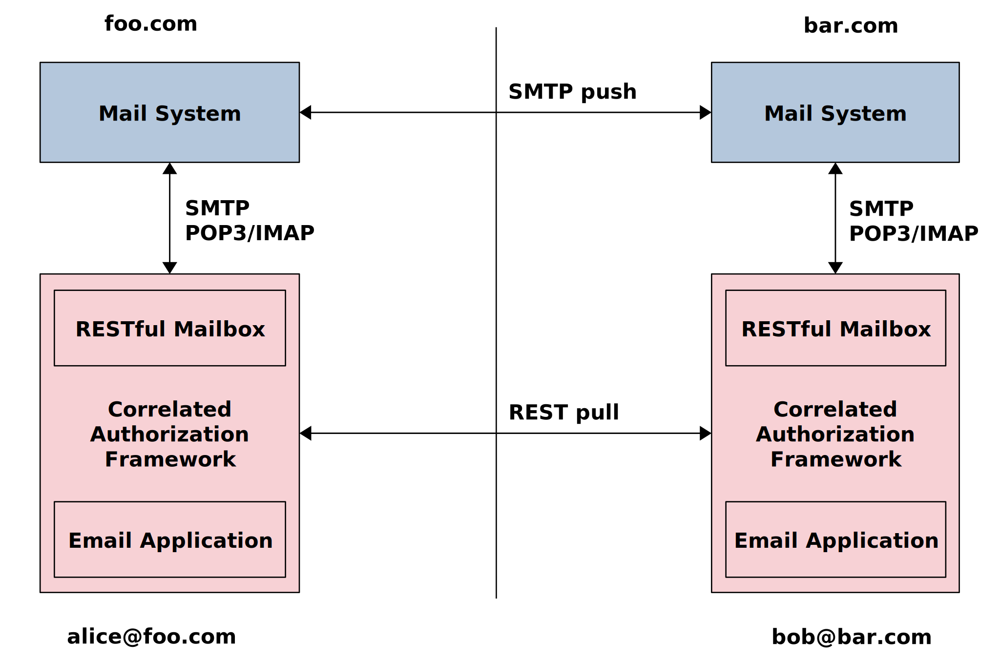

<!-- @import "AEMS_500.less" -->

# Authorization-Enhanced Mail System (AEMS) in less than 500 words

    Igor Zboran 
    izboran@gmail.com

## Introduction

This paper intends to explain how the mail trust framework, Correlated Authorization [1], can improve the current mail system.

## Concept

 AEMS follows the concept of Correlated Authorization [1] while keeping compatibility with the current mail system. We propose to integrate the Correlated Authorization framework with the mail system using a standardized SMTP/POP3/IMAP interface and at the same time mirror the existing email infrastructure by creating the parallel system of RESTful mailboxes. A web-based email application can access the RESTful mailboxes, as illustrated in Figure 1. AEMS uses a two-way push-pull data transfer mechanism—SMTP protocol for push data and HTTP protocol for pull data.

Fig.&nbsp;1.&emsp;Concept

## Key points

1. An email comprises resources (message and attachments) stored in a RESTful mailbox—an email-specific resource server.
2. The email resources owned by the sender, stored in a sender’s RESTful mailbox, are temporarily shared with the recipient. Following a successful sharing process, a notification email with the email resources identifier is sent to the recipient through the standard email system.
3. The recipient’s client, which acts on behalf of the recipient, retrieves the notification email, gets delegated access using an authorization grant, and downloads the email resources from the sender’s RESTful mailbox. The downloaded data are stored in the recipient's RESTful mailbox.

## Advantages over Current Mail System

1. Security and Privacy: User correspondence takes place between RESTful mailboxes. The mailbox of the current email system is only used for the system (registration, notification) emails. This architecture guarantees more control over potential security and privacy issues such as leakage of intellectual property or loss of confidential content.
2. Usability: The RESTful mailbox is decoupled from the email address. It allows a user with a single email address to use simultaneously multiple RESTful mailboxes. To separate official, business, personal, and healthcare correspondence, AEMS provides the flexibility for storing emails according to various criteria within an appropriate RESTful mailbox service provider. 
3. Platform: With the capability to store, locate, send and receive any content, including documents, images, audios, and videos, the proposed solution can be considered a promising platform for Content Services.

## References

[1]&nbsp;I. Zboran “Correlated Authorization” GitHub repository https://github.com/umalabs/correlated-authorization/raw/main/Correlated_Authorization.pdf. 

