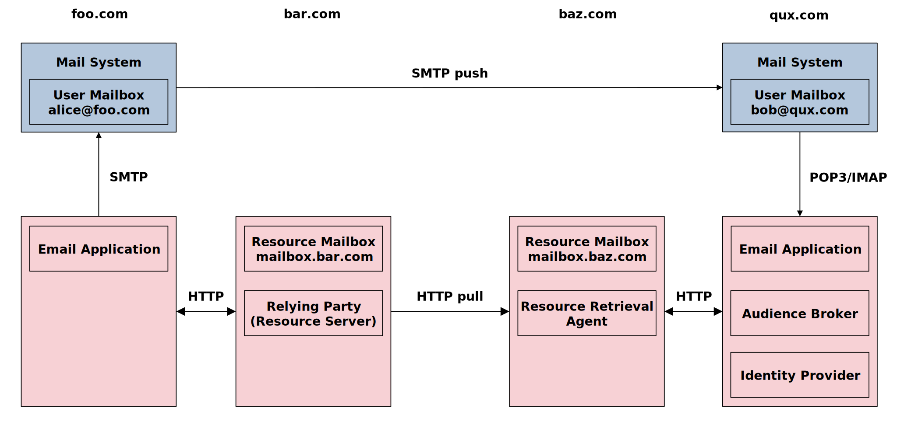

<!-- @import "AEMS_500.less" -->

# Authorization-Enhanced Mail System (AEMS) in less than 500 words

    Igor Zboran 
    izboran@gmail.com

## Introduction

&emsp;This paper intends to explain how the trust framework, Correlated Authorization [1], can improve the current mail system.

## Concept

 &emsp;AEMS follows the concept of Correlated Authorization [1] while keeping compatibility with the standard mail system. We propose to integrate the Correlated Authorization [1] trust framework with the mail system using a standardized SMTP/POP3/IMAP interface and at the same time mirror the existing email infrastructure by creating the parallel system of resource mailboxes. A web-based email application will access the resource mailbox, as illustrated in Figure 1. AEMS uses a two-way push-pull data transfer mechanism—SMTP protocol for push data and HTTP protocol for pull data.

Fig.&nbsp;1.&emsp;Concept

## Key points

• An email is comprised of resources (message and attachments) stored in a resource mailbox—an email-specific resource server.
• The email resources owned by the sender, stored in a sender's resource mailbox, are temporarily shared with the recipient. Following a successful sharing process, a notification email with the email resources identifier (resources URI) is sent to the recipient through the standard email system.
• The recipient's resource retrieval agent, which acts on behalf of the recipient, gets the resources URI from the email application, gets delegated access from the sender authorization server using an authorization grant, and retrieves the email resources from the sender resource mailbox. The retrieved data are stored in the recipient resource mailbox.

## Advantages over Standard Mail System

**Security and Privacy:** User correspondence takes place between resource mailboxes. The user mailbox of the standard mail system is only used for the system (registration, notification) emails. This architecture guarantees more control over potential security and privacy issues such as leakage of intellectual property or loss of confidential content. Moreover, the user decides from whom or not to accept the email and thus protects his email address from spam.
**Usability and Privacy:** The resource mailbox is decoupled from the user's email address. This separation allows a user with a single email address to use multiple resource mailboxes simultaneously. Thus, AEMS can keep official, business, personal, and healthcare correspondence separately in designated resource mailboxes. 
**Platform:** With the capability to store, locate, send and receive any content, including documents, images, audios, and videos, the proposed solution can be considered a promising platform for Content Services.

## References

[1]&nbsp;I. Zboran, "Correlated Authorization," GitHub repository https://github.com/umalabs/correlated-authorization/raw/main/Correlated_Authorization.pdf. 

